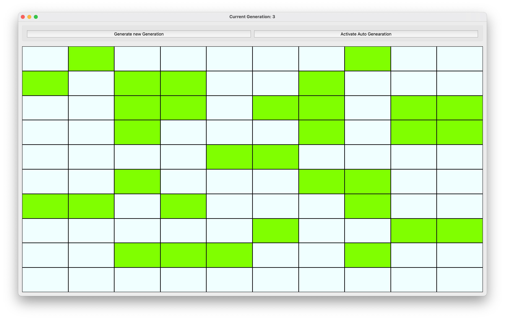

# game_of_life_py

Implementation of the [Conway's Game of Life](https://en.wikipedia.org/wiki/Conway%27s_Game_of_Life) on the Python language.

It is an education project to learn Python as a language, try python tools for UI and build desktop app.
- [game_of_life_py](#game_of_life_py)
- [The main technologies that were used in the scope of this project](#the-main-technologies-that-were-used-in-the-scope-of-this-project)
- [How this game looks like](#how-this-game-looks-like)
  - [Main window](#main-window)
  - [Menu options](#menu-options)
  - [New Game Popup](#new-game-popup)
  - [Game process window](#game-process-window)
- [Main functionality of the game](#main-functionality-of-the-game)
- [Technical Information](#technical-information)
  - [Structure of the repository](#structure-of-the-repository)
  - [Build from sources](#build-from-sources)
    - [Prerequisites](#prerequisites)
    - [Build from sources](#build-from-sources-1)
- [TODO in the future](#todo-in-the-future)

# The main technologies that were used in the scope of this project

- Programming Language: Python 3.10.5 (All development was made on the Mac OS X)
- UI Framework: [PyQt6](https://riverbankcomputing.com/software/pyqt/intro)
- Dependency management: [Poetry](https://python-poetry.org/)
- Build tool (Binary distribution of the final APP): [pyinstaller](https://pyinstaller.org/en/stable/)

# How this game looks like

Below you can find screenshots made on Mac OS X

## Main window


## Menu options


## New Game Popup


## Game process window



# Main functionality of the game

You as a user of this app (game) has ability to:
- Start New Game (via menu entry or by pressing (Windows/Linux) **ctrl+N** /(Mac OS X) **Command+N**)
- Load Game (via menu entry or by pressing (Windows/Linux) **ctrl+L** /(Mac OS X) **Command+L**)
- Save Game (via menu entry or by pressing (Windows/Linux) **ctrl+S** /(Mac OS X) **Command+S**)
- Exit Game (via menu entry, windows controls or by pressing (Windows/Linux) **ctrl+Q** /(Mac OS X) **Command+Q**))
- During the game process user can:
  - Push button "Generate new Generation" - to create next generation based on the current field (cells) state
  - Push button "Activate Auto Generatio" - to automate of the creation next generation
  - Push any field button (cell) to change it status from Dead to Alive or vice-versa.

> <span style="color:#7FFF00">**GREEN**</span> cells represent alive CELLs
> 
> <span style="color:#F0FFFF">**GRAY**</span> (light gray) cells represent dead CELLs

# Technical Information

## Structure of the repository
- **docs** - folder with screenshots and should be used for keeping any documentation
- **gameoflifeapi** - folder with the base code of the app and provides package with console version and API to build UI around this API
- **gameoflifeqt** - folder with implementation of the QT UI for the game API
- **tests** - folder contains unittests for the **gameoflifeapi**
- [**.flake**](.flake8) - file contains configuration to the [Flake8 Style Guide Tool](https://flake8.pycqa.org/en/latest/#)
- [**pyproject.toml**](pyproject.toml) - all the configuration of the project for the package managers and build tools
- [**poetry.lock**](poetry.lock) - lock file with all the dependencies used in the project. More information about poetry can be found on their [website](https://python-poetry.org/)

## Build from sources

### Prerequisites
- You should have install Python to you PC. Python installers and instructions can be found on the official [**Python Page**](https://www.python.org/)
- You also should have to install Poetry package manager. Instruction can be found on the official [**Poetry page**](https://python-poetry.org/docs/#installation)
- If you want to clone this repository, then probably you also need a [**GIT**](https://git-scm.com/) preinstalled.

### Build from sources

1. Open Terminal on your OS
2. Navigate to the folder with this app

```shell
cd /path/to/the/root/of/game_of_life_py
```
3. Create virtual environment for Python if you want to have all the dependencies preinstalled inside app directory. Poetry will automatically create virtual environment, but if you create one inside app folder - poetry will use this instead its default.

```shell
python3 -m venv .venv 
```

4. Install dependencies by poetry

```shell
poetry install
```

5. After installation, you should now have ability to start application via entry points created in the scope of installation script

**Console version**

```shell
poetry run gameoflifeconsole
```

**QT UI version**

```shell
poetry run gameoflifeqt
```

6. To build **PACKAGE** for using in the other projects or to push to cloud package repositories run:
```shell
poetry build
```
It will build **tar.gz** and **.whl** packages

7. To build EXECUTABLES to have game as one executable file for Mac OS or Windows, or any supported OS try this command
```shell
pyinstaller --onefile --windowed gameoflifeqt/app_qt.py
```
After this command execution in:
- folder **build/app_qt** you will find build intermediate files
- folder **dist** you will find executable app for your OS where you run the build command (app_qt.exe/app_qt.app)

8. Now you can use a built executable to run the app/game

# TODO in the future
In this project there are plans to add:
- other languages to UI
- Replace buttons in the field with custom drawing elements for better performance and look